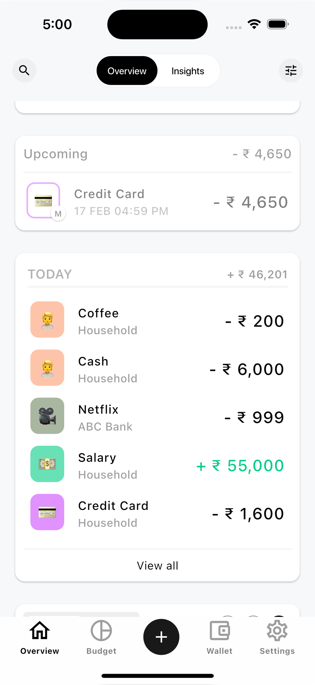
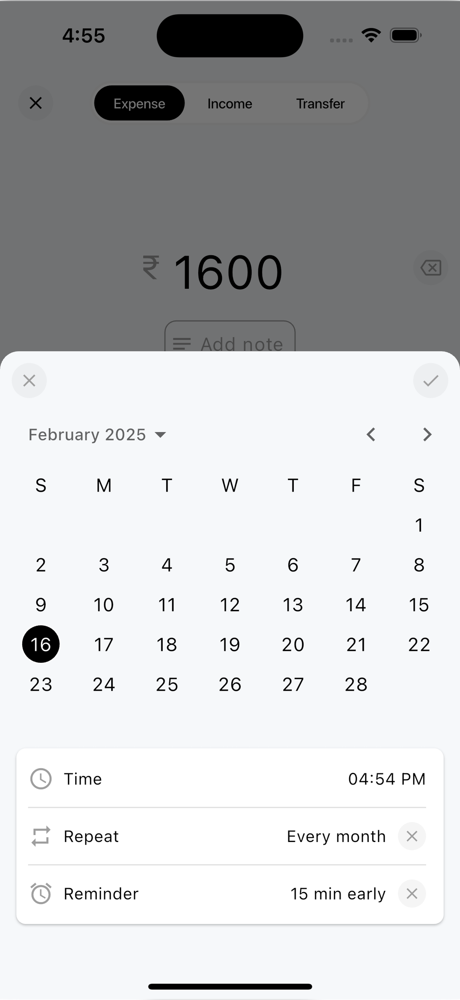
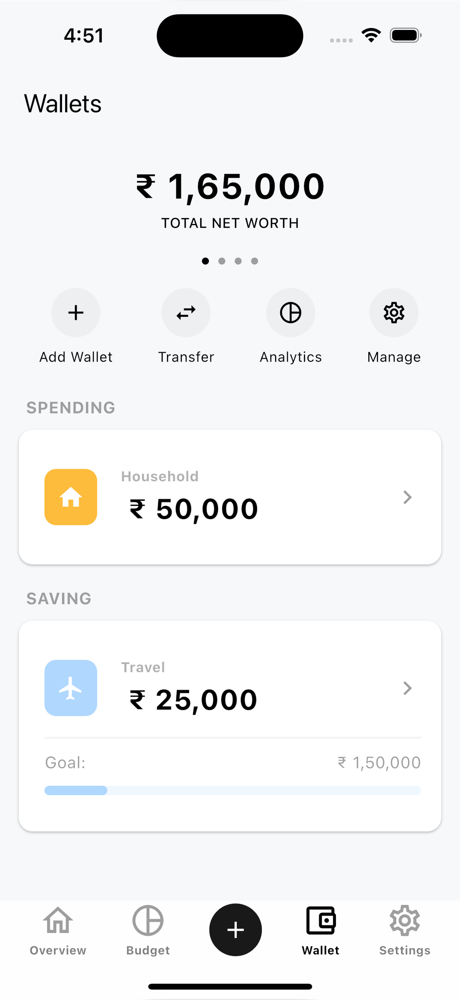
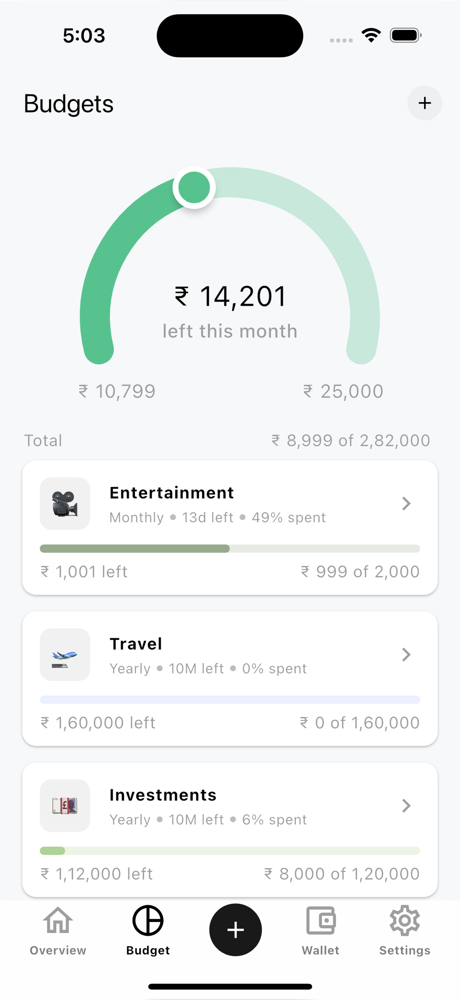
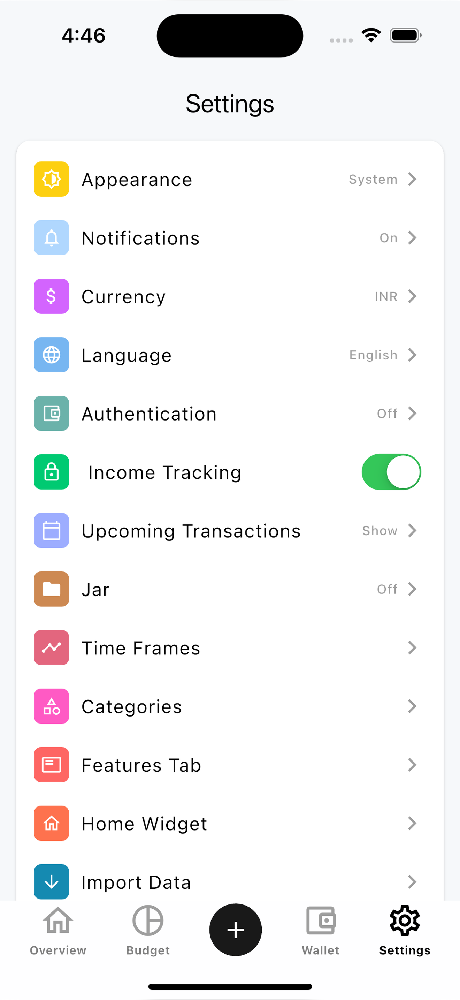
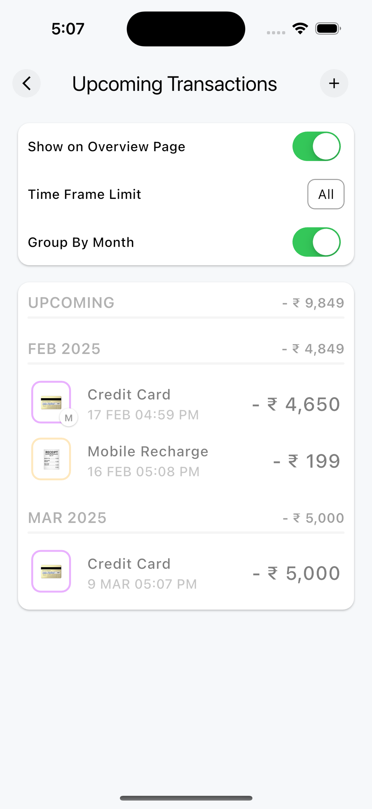
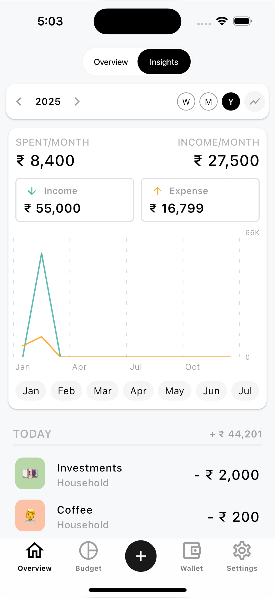

# Expense Trackey

Expense Trackey is a free & personal finance tracker. I will launch on 26 February 2025. stay tuned  [Download Expense Trackey on the App Store.](https://apps.apple.com/sg/app/)

## App Preview

   
   
  

  
  
  
  

## About App

- Income & Expense Tracking: Record your daily, weekly, or monthly income and expenses with ease. Categorize your spending for better organization.
- Set daily, weekly, monthly and yearly budgets and track your progress towards financial goals. Stay on top of your spending limits and make smarter choices.
- Never forget a payment again. Set up recurring transactions like subscriptions, bills, and memberships.
-  Get timely reminders for upcoming bills and payments so you can stay ahead of due dates
-  Add multiple wallets (bank, cash, digital, etc.) and track your balances in one place
-  Keep your financial data secure with biometric authentication (Face ID/Touch ID) or a password for extra privacy
-  Seamlessly import and export your financial data for easy backup or sharing with accountants or other financial platforms

## How to help

- Please feel free to raise [issues](https://github.com/kishankumawat03/expense-trackey/issues) for any inquiries, suggestions for improvements, or bugs you encounter.

## Licence

This project is licensed under the GNU General Public License v3.0
