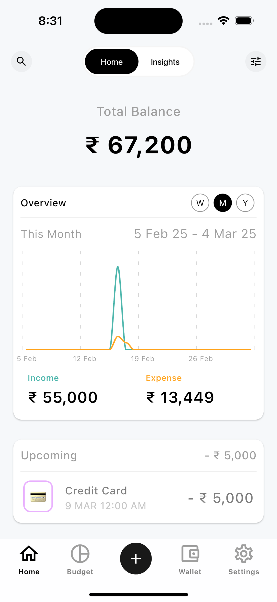
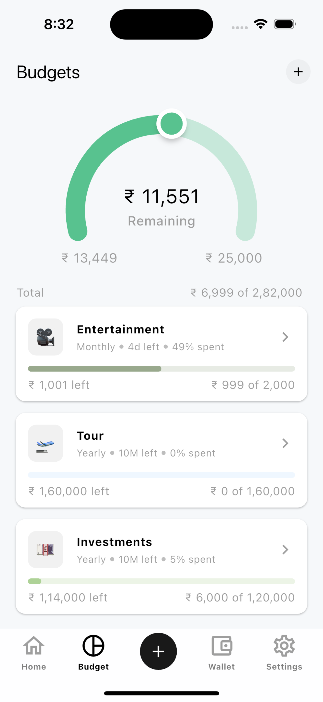

# Expense Trackey

Effortlessly track your income and expenses with 100% free app & without any ads. Stay organized and take control of your financial goals. [Download Expense Trackey on the App Store.](https://apps.apple.com/sg/app/id6739773550)

## App Preview

   
   
  

  
  
  

## About App

- Track Your Finances with Ease: Effortlessly record your daily, weekly, or monthly income and expenses. Categorize every transaction for better clarity and control.
- Set Financial Goals: Establish daily, weekly, monthly, and yearly budgets, and monitor your progress towards achieving your financial aspirations.
- Never Miss a Payment: Automate your recurring payments like bills, subscriptions, and memberships, ensuring you're always on time.
- Stay Ahead with Reminders: Get timely notifications for upcoming bills and payments to avoid any late fees.
- Manage Multiple Wallets: Add various accounts—bank, cash, digital wallets—and view all your balances in one convenient location.
- Enhanced Security: Protect your financial information with biometric authentication (Face ID/Touch ID) or a secure password for added privacy.
- Effortless Data Backup: Easily import and export your financial data for seamless backup or sharing when necessary.

## How to help

- Please feel free to raise [issues](https://github.com/kishankumawat03/expense-trackey/issues) for any inquiries, suggestions for improvements, or bugs you encounter.

## Licence

This project is licensed under the GNU General Public License.
