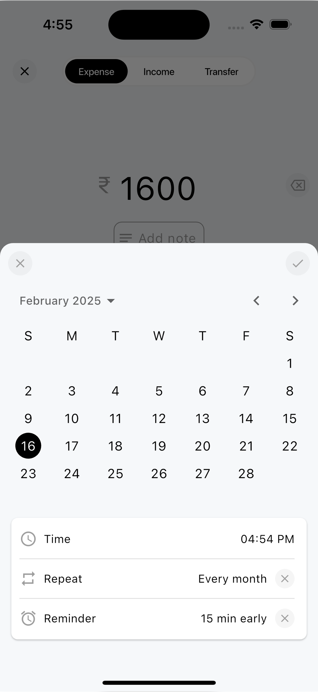
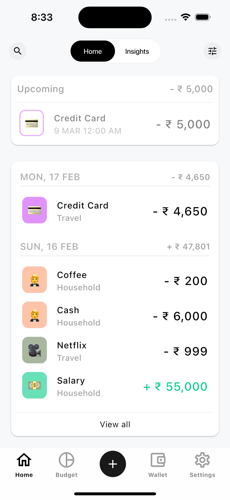
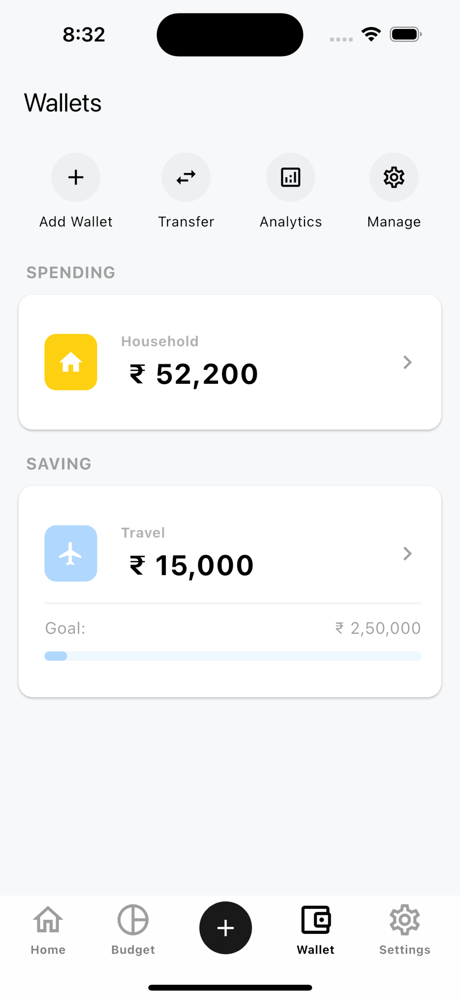

# Expense Trackey

Expense Trackey is a free & personal finance tracker. I will launch on 26 February 2025. stay tuned  [Download Expense Trackey on the App Store.](https://apps.apple.com/sg/app/)

## App Preview

   
   
  

  
  
  
  

## About App

- A great way to mange your income & expense with feature rich budget & expense Tracker.

## How to help

- Please feel free to raise [issues](https://github.com/kishankumawat03/expense-trackey/issues) for any inquiries, suggestions for improvements, or bugs you encounter.

## Licence

This project is licensed under the GNU General Public License.
